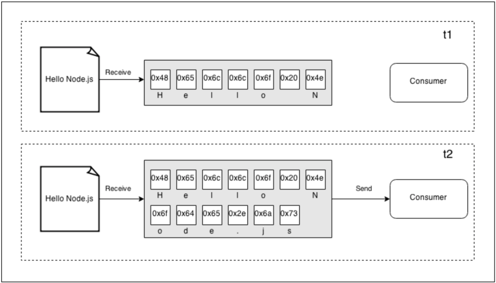
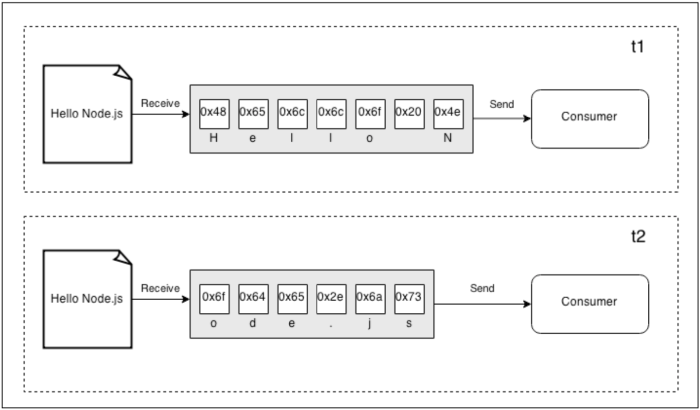
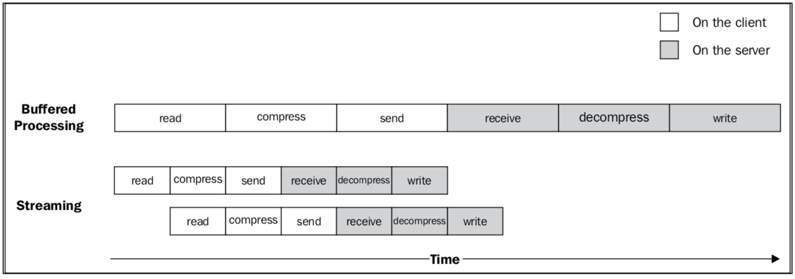
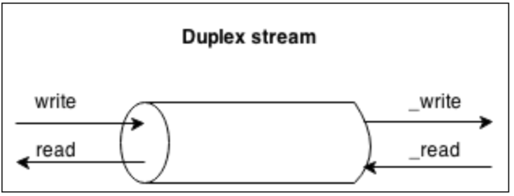
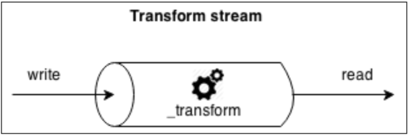

## 스트림의 중요성
Node.js와 같이 이벤트 기반 플랫폼에서 I/O를 처리하는 가장 효율적인 방법은 실시간으로 들어온 입력 값을 가능한 즉시 애플리케이션에 내보내는 것이다.

### 버퍼 vs 스트리밍
버퍼 모드는 리소스로 오는 모든 데이터를 버퍼에 수집했다가 자원을 모두 다 읽어들인 후 콜백에 전달. 반면
스트림은 리소스에서 도착하자마자 데이터를 처리할 수 있다.

버퍼 모드


스트림 모드


스트림의 이점은 공간 효율성, 시간 효율성, 결합성이 있다.

### 공간 효율성
스트림은 버퍼링하여 모든 데이터를 한꺼번에 처리하는 방식으로 불가능한 작업을 처리할 수 있다. V8 버퍼는 0x3FFFFFFF바이트(1GB 정도)보다 클 수 없다. 물리적인 메모리가 부족해지기 전에 대용량 파일을 처리할 때 문제가 된다. 만약 1GB보다 큰 파일을 읽어들일 때 허용된 최대 버퍼의 크기보다 크다는 오류 메시지를 보게 될 것이다.

버퍼링된 API를 사용한 Gzipping
`gist:vanayun/6124d9c66d582df14f941188de0e3c8b#buffer_gzip.js`
스트림을 사용한 Gzipping
`gist:vanayun/6124d9c66d582df14f941188de0e3c8b#stream_gzip.js`

### 시간 효율성
스트림을 사용하면 전체 파일을 읽을 때까지 기다리지 않고 첫 번째 데이터 덩어리를 수신하자마자 조립 라인이 사작된다. 데이터의 다음 덩어리가 사용 가능한 상태가 될 때, 이전 작업들이 완료될 때까지 기다리지 않고 비동기적으로 실행된다. 유일한 제약은 데이터 덩어리가 도착하는 순서가 보존되어야 한다는 것인데 Node.js 스트림이 처리해준다. 버퍼를 사용하는 것 보다 전체 프로세스의 시간이 단축된다.

1. [Client] 파일 시스템에서 데이터를 읽는다.
2. [Client] 데이터를 압축.
3. [Client] 서버로 전송.
4. [Server] 클라이언트로부터 수신.
5. [Server] 데이터의 압축을 푼다.
6. [Server] 디스크에 데이터를 쓴다.

### 결합성
스트림 코드를 작성할 때, 단일 기능을 담당하는 서로 다른 프로세스 유닛들을 연결할 수 있는 **pipe()**메소드를 사용하였다.
이는 스트림이 균일한 인터페이스를 가지며 API측면에서 서로를 이해할 수 있기 때문에 가능하다. 유일한 전제 조건은 파이프라인의 다음 스트림이 이전 스트림에 의해 생성되어 전달된 데이터 타입을 지원해야 한다는 것이다. 이 데이터 타입에는 바이너리, 텍스트, 또는 객체가 될 수 있다.
```javascript
const crypto = require('crypto');
//...
fs.createReadStream(file)
  .pipe(zlib.createGzip())
  .pipe(crypto.createCipher('aes192', 'a_shared_secret'))
  .pipe(req)
  .on('finish', () => console.log('File successfully sent'));

```
이 접근법의 주요 장점은 재사용성이지만 확실히 스트림을 사용하면 더 깨끗하고 모듈화된 코드를 만들 수 있다. 스트림은 순수한 I/O를 다루는 것뿐만 아니라 코드를 단순화하고 모듈화하는 수단으로 사용되기도 한다.

## 스트림 시작하기
스트림은 Node.js 핵심 모듈을 비롯한 모든 곳에서 사용된다. fs 모듈에서 createReadStream(), createWriteStream(), HTTP request 및 response 객체는 기본적으로 스트림이며 데이터 압축과 압축 해제를 위한 zlib는 스트리밍 인터페이스를 사용한다.

### 스트림의 구조
Node.js에서 모든 스트림은 스트림의 코어 모듈에서 사용할 수 있는 네 가지 추상 클래스 중 하나의 구현체이다.
- [stream.Readable](#stream.Readable)
- [stream.Readable](#stream.Writable)
- [stream.Duplex](#stream.Duplex)
- [stream.Transform](#stream.Transform)

각 스트림 클래스는 EventEmitter의 인스턴스이기도 하다. 스트림은 읽기가 끝났을 때 발생하는 end, 에러가 발생했을때 error와 같은 다양한 이벤트를 제공한다.

### Readable 스트림 <a id="stream.Readable"></a>
데이터 소스를 나타낸다. Readableabstract 클래스르 사용하여 구현된다.

#### 스트림 읽기
데이터를 수신하는 방법으로 non-flowing, flowing 두 가지가 있다.
- non-flowing : Readable 스트림에서 읽기 기본 패턴은 새로운 데이터를 읽을 준비가 되었다는 신호인 readable 이벤트에 listener를 등록하는 것. 데이터는 readable 리스너에서 독점적으로 읽을 수 있다. 리스너는 새로운 데이터가 읽기 가능하게 되는 즉시 호출된다.
```javascript
process.stdin
  .on('readable', () => {
    let chunk;
    while((chunk = process.stdin.read()) !== null) {
      console.log(`Chunk read : (${chunk.length}) "${chunk.toString()}"`);
    }
  })
  .on('end', () => process.stdout.write('End of stream'));
```
- flowing : data 이벤트에 리스너를 등록하는 것. read()를 사용하여 꺼내지 않고 데이터가 도착하자마자 해당 리스너에게 전달.
Flowing모드는 Stream1의 상속이며 데이터 흐름 제어를 위한 유연성이 떨어진다. Stream2 인터페이스 도입으로 기본 작동 모드가 아니다.
```javascript
process.stdin
  .on('data', chunk => {
      console.log(`Chunk read : (${chunk.length}) "${chunk.toString()}"`);
  })
  .on('end', () => process.stdout.write('End of stream'));
```

#### Readable 스트림 구현하기
stream.Readable의 prototype을 상속받아 _read() 함수를 구현.
`gist:vanayun/6124d9c66d582df14f941188de0e3c8b#randomStream.js`
RandomStream 객체를 인스턴스 화 하고 그 인스턴스에서 데이터 획득해보기
```javascript
const RandomStream = require('./randomStream');
const randomStream = new RandomStream();

randomStream.on('readable', () => {
  let chunk;
  while((chunk = randomStream.read()) !== null) {
    console.log(`Chunk received: ${chunk.toString()}`);
  }
});
```

### Writable 스트림 <a id="stream.Writable"></a>
Writable 스트림은 데이터의 목적지를 나타낸다.

#### 스트림에 쓰기
```javascript
writable.write(chunk, [encoding], [callback])
```
encoding 인자는 선택 사항. chunk가 string일 경우 지정가능 (기본 utf8) chunk가 Buffer인 경우는 무시된다.

```javascript
writable.end([chunk], [encoding], [callback])
```
더이상 스트림에 기록할 데이터가 없을 때 end() 메소드를 사용한다. 마지막 데이터 값 전달. 이 경우 콜백 함수는 스트림에 쓴 모든 데이터가 하위 리소스로 flush되었을 때 finish 이벤트에 listener를 등록하는 것과 같다.

#### Writable 스트림 구현
stream.Writable의 prototype을 상속받아 _write() 함수를 구현.
`gist:vanayun/6124d9c66d582df14f941188de0e3c8b#toFileStream.js`

스트림에 대한 쓰기 작업 해보기
```javascript
const ToFileStream = require('./toFileStream');
const tfs = new ToFileStream();

tfs.write({path: "file1.txt", content: "Hello"});
tfs.write({path: "file2.txt", content: "Node.js"});
tfs.write({path: "file3.txt", content: "Streams"});
tfs.end(() => console.log('All files created'))
```
실행하면 3개의 파일이 생성된다.

### Duplex 스트림 <a id="stream.Duplex"></a>
양방향은 Readable과 Writable 모두가 가능한 스트림이다. 소캣처럼 데이터 소스와 목적지를 모두 가지는 항목을 다룰 때 유용하다.


### Transform 스트림 <a id="stream.Transform"></a>
Transform 스트림은 데이터 변환을 처리하도록 설계된 특별한 종류의 이중 스트림이다.
Writable 쪽에서 받은 각 데이터들에게 어떤 종류의 변경을 적용한 수 변형된 데이터들을 Readable 쪽에서 사용할 수 있도록 한다.

새로운 Transform 스트림을 구현할 때는 transform()과 _flush()메소드를 추가로 작성해야 한다.

### Transform 스트림 구현
`gist:vanayun/6124d9c66d582df14f941188de0e3c8b#replaceStream.js`
```javascript
const ReplaceStream = require('./replaceStream');
const rs = new ReplaceStream('World', 'Node.js');
rs.on('data', chunk => console.log(chunk.toString()));

rs.write('Hello W');
rs.write('orld!');
rs.end();
```