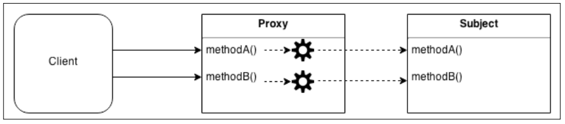

## 프록시(Proxy)
프록시는 다른 객체에 대한 접근을 제어하는 객체. 여기서 다른 객체를 **대상(Subject)**라고 한다.
프록시와 대상은 동일한 인터페이스를 가지고 있으며 이를 통해 다른 인터페이스와 완전히 호환되도록 바꿀 수 있다.
실제 이 패턴의 다른 이름은 서로게이트(surrogate)이다. 프록시는 대상에서 실행될 작업의 전부 또는 일부를 가로채서 해당 동작을 향상시키거나 보완한다.
프록시는 각 작업의 대상으로 전달하여 추가적인 전처리 또는 후처리로 동작을 향상시킨다.



> 클래스들 간의 프록시를 말하는 것이 아니라 대상의 실제 인스턴스를 감싸서 해당 상태를 유지하는 것을 포함한다.

<프록시 활용의 예>
- **데이터 유효성 검사(Data validation)** : 프록시가 입력을 대상으로 전달하기 전에 유효성을 검사한다.
- **보안(Security)** : 프록시는 클라이언트가 작업을 수행할 수 있는 권한이 있는지 확인하고 검사 결과가 긍정적인 경우에만 요청을 대상으로 전달한다.
- **캐싱(Caching)** : 프록시가 내부 캐시를 유지하여 데이터가 캐시에 아직 존재하지 않는 경우에만 대상에서 작업이 실행되도록 한다.
- **지연 초기화(Lazy initialization)** : 대상의 생성 비용이 비싸다면 프록시는 그것을 필요로 할때까지 연기할 수 있다.
- **로깅(Logging)** : 프록시는 메소드 호출과 상대 매개 변수를 인터셉트하고 이를 기록한다.
- **원격 객체(Remote objects)** : 프록시는 원격 위치에 있는 객체를 가져와서 로컬처럼 보이게 할 수 있다.

### 프록시 구현 기술

#### 오브젝트 컴포지션
컴포지션은 기능을 확장하거나 사용하기 위해 객체가 다른 객체와 결합되는 기술이다.

```javascript
function createProxy(subject) {
  const proto = Object.getPrototypeOf(subject);

  function Proxy(subject) {
    this.subject = subject;
  }

  Proxy.prototype = Object.create(proto);

  //프록시된 메소드
  Proxy.prototype.hello = function() {
    return this.subject.hello() + 'world!';
  };

  // 델리게이트된 메소드
  Proxy.prototype.goodbye = function() {
    return this.subject.goodbye.apply(this.subject, arguments);
  };

  return new Proxy(subject);
}

module.exports = createProxy;
```

위의 코드를 JavaScript의 동적 타입 결정으로 상속을 사용하지 않고 객체 리터럴과 팩토리를 사용하여 작성할 수 있다.

```javascript
function createProxy(subject) {
  return {
    // 프록시된 메소드
    hello: () => (subject.hello() + 'world!'),

    // 델리게이트된 메소드
    goodbye: () => (subject.goodbye.apply(subject, arguments))
  };
}
```

> 대두분의 메소드를 위임하는 프록시를 만들려면 [delegates](https://npmjs.org/package/delegates)와 같은 라이브러리를 사용하여 자동으로 생성하는 것이 편리하다.

#### 객체 증강(Object augmentation)
객체 증강(몽키 패치)은 객체의 개별 메소드를 프록시하는 가자 실용적인 방법이다. 메소드를 프록시된 구현체로 대체하여 직접 대상을 수정하는 것

```javascript
function createProxy(subject) {
  const helloOrig = subject.hello;
  subject.hello = () => (helloOrig.call(this) + 'world');
  return subject;
}
```
하나 또는 몇 개의 메소드만 프록시할 필요가 있을 때 가장 편리한 메소드지만 대상 객체를 직접 수정하는 단점이 있다.

컴포지션은 대상을 그대로 두어 원래의 동작을 변경하지 않기 때문에 프록시를 만드는 가장 안전한 방법이다. 모든 메소드를 수동으로 위임(delegate)해야하는 단점이 있다.
대상을 필요한 경우에만 생성(지연 초기화 - lazy initialization) 하기 위해 대상의 초기화를 제어하는 경우에 사용.
> 객체의 속성은 Object.defineProperty()를 사용하여 위임할 수 있다.

객체 증강은 대상을 수정하므로 프록시를 구현하는 가장 실용적인 방법이다. 대상을 수정하는 것이 큰 문제가 되지 않는 모든 상황에서 선호되는 기술.

**팩토리 함수(createProxy())를 사용하여 프록시를 생성하면 사용된 기술로부터 코드를 보호할 수 있다.**

### Writable 스트림 로그 작성

write() 메소드에 대한 모든 호출을 가로채고 상황이 발생할 때 메시지를 기록하는 Writable 스트림에 대한 프록시를 수행하는 객체
프록시를 구현하기 위해 객체 컴포지션을 사용한다.

```javascript
function createLoggingWritable(writableOrig) {
  const proto = Object.getPrototypeOf(writableOrig);

  function LoggingWritable(writableOrig) {
    this.writableOrig = writableOrig;
  }

  LoggingWritable.prototype = Object.create(proto);

  LoggingWritable.prototype.write = function(chunk, encoding, callback) {
    if(!callback && typeof encoding === 'function') {
      callback = encoding;
      encoding = undefined;
    }
    console.log('Writing ', chunk);
    return this.writableOrig.write(chunk, encoding, function() {
      console.log('Finished writing ', chunk);
      callback && callback();
    });
  };

  LoggingWritable.prototype.on = function() {
    return this.writableOrig.on
      .apply(this.writableOrig, arguments);
  };

  LoggingWritable.prototype.end = function() {
    return this.writableOrig.end
      .apply(this.writableOrig, arguments);
  };

  return new LoggingWritable(writableOrig);
}

// test
const writable = fs.createWriteStream('test.txt');
const writableProxy = createLoggingWritable(writable);

writableProxy.write('First chunk');
writableProxy.write('Second chunk');
writable.write('This is not logged');
writableProxy.end();
```
프록시는 스트림의 원래 인터페이스나 외부 동작을 변경하지 않았다.

### 함수 후크(function hooks) 및 AOP
프록시 생성을 단순화 할 수 있는 라이브러리들은 대부분 객체 증강을 사용하여 구현되어있다.
이 패턴은 **함수 후킹(function hooking)** 이라고 하며 **AOP(Aspect Oriented Programming)**라고도 한다.
AOP에서 특정 메소드 전후에 실행 후크를 설정할 수 있도록 한다. 메소드 실행전이나 실행 후에 커스텀 코드를 실행할 수 있게 한다.

종종 프록시를 **미들웨어**라고도 한다. 미들웨어 패턴처럼 함수의 입력/출력 전처리와 후처리를 할 수 있기 때문이다.
아래와 같은 라이브러리로 함수 훅(hook)을 구현할 수 있다.
[hooks](https://npmjs.org/package/hooks), [hooker](https://npmjs.org/package/hooker), [meld](https://npmjs.org/package/meld)

### ES2015 Proxy
ES2015 사양에서 Proxy라는 전역 객체가 도입되었다.
Proxy API에는 타겟 및 핸들러를 인자로 허용하는 Proxy생성자 포함.

```javascript
const proxy = new Proxy(target, handler);
```

target은 프록시가 적용되는 객체(Subject) handler는 프록시의 동작을 정의하는 특수한 객체.
handler에는 트랩 메소드(apply, get, set ... has)라는 사전에 정의된 이름을 가진 일련의 선택적 메소드들이 포함되어 있다.

```javascript
const scientist = {
  name: 'nikola',
  surname: 'tesla'
};

const uppercaseScientist = new Proxy(scientist, {
  get: (target, property) => target[property].toUpperCase()
});

console.log(uppercaseScientist.name, uppercaseScientist.surname);
```
target 객체 내의 일반 속성에 대한 접근을 가로챌 수 있다.

```javascript
const evenNumbers = new Proxy([], {
  get: (target, index) => index * 2,
  has: (target, number) => number % 2 === 0
});

console.log(2 in evenNumbers); //true
console.log(5 in evenNumbers); //false
console.log(evenNumbers[7]); // 14
```