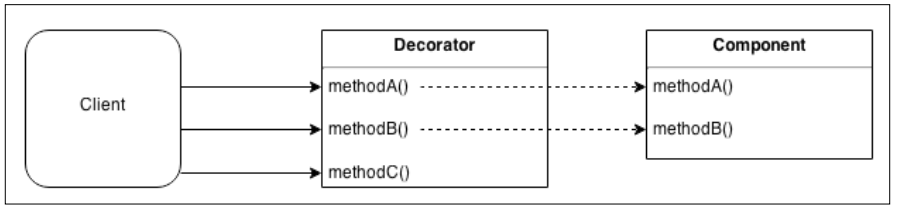

## 데코레이터(Decorator)
데코레이터는 기존 객체의 동작을 동적으로 증강시키는 구조적인 패턴이다.
동일한 클래스의 모든 객체에 추가되지 않고 명시적으로 데코레이트한 인스턴스에만 추가되기 때문에 고전적인 상속과는 다르다.

Proxy패턴과 유사하나 객체의 기존 인터페이스 동작을 향상하거나 수정하는 대신 새로운 기능으로 기능을 증가시킨다.



### 데코레이터 구현 기법
프록시와 구현 전략을 공유한다.

#### 컴포지션
데코레이팅된 컴포넌트가 일반적으로 상속받은 새 객체로 둘러싸여 배치된다. 데코레이터는 기존 메소드를 원래 컴포넌트로 위임하면서 새 메소드를 정의한다.

```javascript
function decorate(component) {
  const proto = Object.getPrototypeOf(component);

  function Decorator(component) {
    this.component = component;
  }

  Decorator.prototype = Object.create(proto);

  //새 메소드
  Decorator.prototype.greetings = function() {
    return 'Hi!';
  };
  //위임된 메소드
  Decorator.prototype.hello = function() {
    return this.component.hello.apply(this.component, arguments);
  };

  return new Decorator(component);
}
```

#### 객체 증강
데코레이팅된 객체에 직접 새 메소드를 연결하여 객체 데코레이션을 수행할 수도 있다.

```javascript
function decorate(component) {
  // 새 메소드
  component.greeting = () => {
    //...
  }
  return component
}
```

### LevelUP 데이터베이스 장식하기
[LevelUP](https://npmjs.org/package/levelup)은 Chrome브라우저에서 IndexedDB를 구현하기 위해 만들어진 Key/Value 저장소인 Google LevelDB와 관련한 Node.js 래퍼이다.

#### LevelUP 플러그인 구현하기
```javascript
module.exports = function levelSubscribe(db) {

  db.subscribe = (pattern, listener) => { //[1]
    db.on('put', (key, val) => { //[2]
      const match = Object.keys(pattern).every(
        k => (pattern[k] === val[k]) //[3]
      );
      if(match) {
        listener(key, val); //[4]
      }
    });
  };

  return db;
};
```
1. subscribe()라는 새로운 메소드로 db 객체를 데코레이트 함.(객체 증강)
2. 데이터베이스에서 수행되는 모든 put 연산을 받는다.
3. 패턴 매칭 알고리즘
4. 일치하는 항목이 있으면 리스너에 통보

```javascript
const level = require('level'); // [1]
const levelSubscribe = require('./levelSubscribe'); // [2]

let db = level(__dirname + '/db', {valueEncoding: 'json'});
db = levelSubscribe(db);

db.subscribe(
  {doctype: 'tweet', language: 'en'}, // [3]
  (k, val) => console.log(val)
);
db.put('1', {doctype: 'tweet', text: 'Hi', language: 'en'}); //[4]
db.put('2', {doctype: 'company', name: 'ACME Co.'});
```
1. levelup 데이터 베이스 초기화 파일이 저장될 디렉토리와 값의 기본 인코딩을 선택
2. 원래 db 객체를 데코레이트하는 플러그인 추가
3. subscribe() 메소드 사용 준비 완료
4. put을 사용하여 데이터베이스에 일부 값을 저장.

객체 증강을 가장 단순하게 구현한 데코레이터 패턴의 실제 적용 사례를 보여주고 있다.